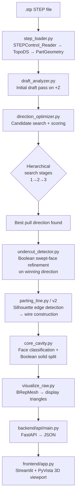
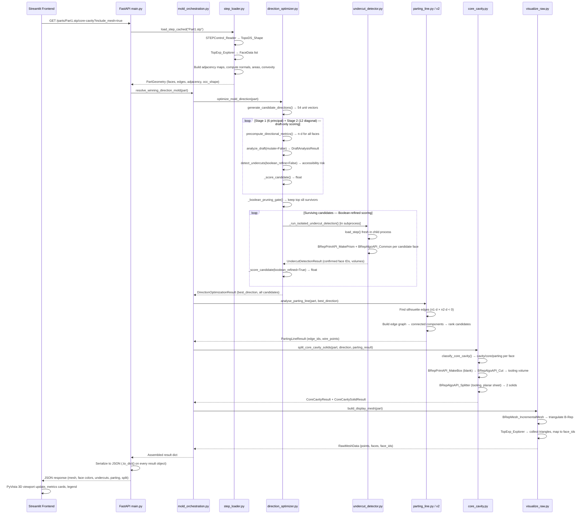
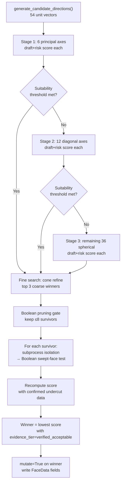
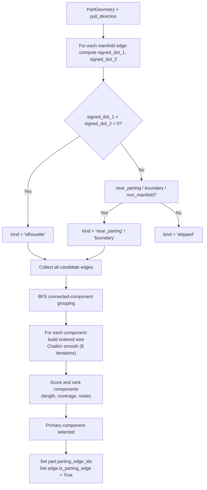
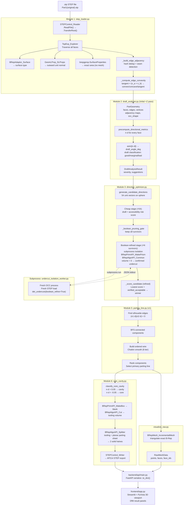

# DfM Agent — Technical Deep Dive

*Bosch RB-CoC Plastics Hackathon · STEP-native Injection-Mold DfM System*

**Document purpose:** Reverse-engineered, implementation-accurate technical documentation for the
current working state of this repository. Every algorithm, formula, data structure, and architectural
decision described here was traced directly from the source code. Nothing is inferred from theory
alone without a source citation.

**Audience:** AIML/software engineering students who understand the DfM problem and basic
Python/backend concepts, but may be new to CAD kernels, STEP, OpenCascade, B-Rep topology,
and computational geometry.

---

## Table of Contents

1. [What This Project Actually Does](#1-what-this-project-actually-does)
2. [Mental Model Before Reading the Code](#2-mental-model-before-reading-the-code)
3. [STEP → OpenCascade → Python](#3-step--opencascade--python)
4. [Repository Architecture](#4-repository-architecture)
5. [End-to-End Request Lifecycle](#5-end-to-end-request-lifecycle)
6. [Part Topology Analysis](#6-part-topology-analysis)
7. [Draft Analysis](#7-draft-analysis)
8. [Pull-Direction Detection](#8-pull-direction-detection)
9. [Geometry and Math Behind Pull Direction](#9-geometry-and-math-behind-pull-direction)
10. [Undercut Detection](#10-undercut-detection)
11. [Pull Direction ↔ Draft ↔ Undercut Relationship](#11-pull-direction--draft--undercut-relationship)
12. [Candidate Direction Evaluation Metrics](#12-candidate-direction-evaluation-metrics)
13. [Parting-Line Detection](#13-parting-line-detection)
14. [Core/Cavity Split](#14-corecavity-split)
15. [Mesh Generation and Visualization](#15-mesh-generation-and-visualization)
16. [Backend/API Contract](#16-backendapi-contract)
17. [Frontend Data Flow](#17-frontend-data-flow)
18. [Error Handling and Performance](#18-error-handling-and-performance)
19. [Complete Pipeline Diagram](#19-complete-pipeline-diagram)
20. [One Concrete Part1 Walkthrough](#20-one-concrete-part1-walkthrough)
21. [Why the Current Architecture Works](#21-why-the-current-architecture-works)
22. [Historical Evolution](#22-historical-evolution)
23. [Interview Explanation](#23-interview-explanation)
24. [Glossary](#24-glossary)
25. [Source-of-Truth Map](#25-source-of-truth-map)

---

## 1. What This Project Actually Does

### The Engineering Problem

When a plastic part is manufactured by injection molding, molten plastic is forced into a steel mold
at high pressure. After the plastic cools and solidifies, the two halves of the mold (called *core*
and *cavity*) must physically separate—they are pulled apart in a straight line called the *pull
direction*. The part drops out.

This creates a hard manufacturing constraint: **any geometric feature that prevents the mold from
separating cleanly is a defect**, not a design choice. Features that trap the mold are called
*undercuts*. Walls that are too vertical (not tapered enough) will grip the mold surface and tear
during ejection—this is a *draft failure*.

**Design for Manufacturability (DfM)** analysis answers these questions before the mold is
machined:
1. Is there a suitable pull direction?
2. Which faces have insufficient draft (taper)?
3. Which geometric features cannot be released by a straight pull—i.e., true undercuts?
4. Where does the mold split (the parting line)?
5. Which surfaces belong to the cavity half vs. the core half?

### What This System Does

```
STEP CAD file → analyze B-Rep geometry → DfM results → backend API → Streamlit UI
```

**Input:** A `.stp` (STEP ISO 10303) file from Siemens NX or similar CAD tool, containing exact
analytic and NURBS surface descriptions of an automotive plastic part.

**Processing:** The geometry engine, written in Python using the OpenCascade (OCC) CAD kernel
via `pythonocc-core`, extracts topology and geometry from the exact B-Rep representation—not
from an approximation—and runs the full DfM pipeline.

**Output:** For each analyzed direction:
- Draft classification of every face (good / marginal / bad)
- Accessibility risk and Boolean-confirmed undercut features
- A parting-line candidate wire
- Core/cavity face classification and a physical mold-half Boolean split
- A PDF report and/or AI agent narrative

### Why Pull Direction Is Central

Every downstream result is computed *relative to a pull direction*. Change the pull direction and:
- Every face's draft angle changes
- Every undercut determination changes
- The parting line changes
- The core/cavity split changes

Pull direction is not a post-processing detail. It is the axis along which all other geometry is
interpreted.

### High-Level Pipeline



---

## 2. Mental Model Before Reading the Code

### What Is a CAD Solid?

A solid is a closed, bounded volume of 3D space with a mathematically exact description of its
boundary. It differs from a mesh (triangle soup) in that it knows exact curvatures, areas, and
normals at every point—not just at sampled vertices.

### B-Rep: Boundary Representation

The boundary of the solid is represented by a hierarchy of topological entities, each associated
with a geometric object:

| Topological Entity | Geometric Object | What It Means |
|---|---|---|
| `TopoDS_Solid` | volume | The closed bounded region |
| `TopoDS_Shell` | surface set | Connected set of faces forming a closed shell |
| `TopoDS_Face` | `Geom_Surface` | One surface patch (plane, cylinder, spline…) |
| `TopoDS_Wire` | curve loop | Closed loop of edges bounding a face |
| `TopoDS_Edge` | `Geom_Curve` | One curve (line, arc, spline…) |
| `TopoDS_Vertex` | 3D point | Endpoint of an edge |

The key distinction: **topology** is the connectivity structure (which face touches which edge, which
edge has which vertices). **Geometry** is the actual mathematical description (the parametric
surface equation, the 3D curve equation). Both are needed.

### Parametric Surface

A face's geometry is a parametric surface: a function `S(u, v) → (x, y, z)` over a rectangular
domain `[u_min, u_max] × [v_min, v_max]`. A plane face might have `u ∈ [0, 50]`, `v ∈ [0, 30]`.
A cylindrical face wraps around in `u` (periodic). The surface normal at any point is the cross
product of the partial derivatives: `∂S/∂u × ∂S/∂v`, then normalized.

### The Outward Normal Convention

Every `TopoDS_Face` has an *orientation* flag (`FORWARD` or `REVERSED`). The OCC convention is
that the outward normal (pointing away from the material) is the cross-product normal when the
face is `FORWARD`, and negated when `REVERSED`. The step loader in this project always extracts
outward normals after applying the orientation flag. DfM algorithms depend critically on this
sign being correct—normals pointing inward would invert all draft classifications.

### Why Not Use STL/Mesh?

A mesh approximates the surface with flat triangles. Triangle normals are constant per-triangle
and discontinuous at edges. Areas and volumes computed from meshes have tessellation error.
For mold design where parting line placement requires millimetre accuracy and where the
Boolean swept-face test needs exact intersection volumes, this approximation is unacceptable.
OCC provides exact analytic results for planes, cylinders, cones, and spheres, and within OCC's
own numerical tolerance for B-Spline/NURBS surfaces.

### Triangulation Is Only for Display

This project triangulates (`BRepMesh_IncrementalMesh`) the exact B-Rep surfaces only for
the 3D viewport. All DfM calculations operate on the exact B-Rep faces and normals, not the
display mesh.

### STEP

STEP (Standard for the Exchange of Product model data, ISO 10303) is the industry-standard
CAD exchange format. A STEP file is a text file containing entity records (AP203 or AP214
protocol) that describe surfaces, curves, topology, assemblies, and metadata. The important
thing: STEP stores exact B-Rep geometry, not meshes.

---

## 3. STEP → OpenCascade → Python

### OpenCascade Technology (OCC)

OpenCASCADE Technology is a massive open-source C++ library (~1.5 million lines) that provides:
- A complete B-Rep geometry kernel (exact surface/curve math)
- STEP/IGES readers and writers
- Boolean operations (intersection, union, difference)
- Topology traversal algorithms
- Mesh generation

OCC was originally developed by Matra Datavision (then CAS.CADE), open-sourced in 1999, and is
the geometry kernel underlying FreeCAD, Salome, and many commercial CAD tools.

### `pythonocc-core`

`pythonocc-core` (available via `conda-forge` as `pythonocc-core=7.7.2`) is a Python binding for
OCC. It exposes virtually every OCC class and function directly to Python via SWIG-generated
wrappers. The result: Python code calls C++ OCC objects, which do the heavy lifting.

```python
# These are C++ objects wrapped in Python
from OCC.Core.TopoDS import TopoDS_Face, TopoDS_Shape
from OCC.Core.STEPControl import STEPControl_Reader
from OCC.Core.BRepAdaptor import BRepAdaptor_Surface
from OCC.Core.GeomLProp import GeomLProp_SLProps
from OCC.Core.BRepGProp import brepgprop
```

**IMPORTANT:** `pythonocc-core` must be installed via `conda-forge`. Pip builds are unreliable
(the C++ shared libraries must link against the exact OCC version). The `step_loader.py` module
raises a clear warning if it detects a pip install.

### The Loading Pipeline

```
Part1.stp (text file)
        │
        ▼
STEPControl_Reader().ReadFile("Part1.stp")
        │  OCC parses the ISO 10303 entity records
        │  and reconstructs a B-Rep shape tree in C++ memory
        ▼
reader.TransferRoot()  → TopoDS_Shape (the top-level compound/solid)
        │
        ▼
TopExp_Explorer(shape, TopAbs_FACE)   ← traverses every face in order
        │ for each face:
        │   BRepAdaptor_Surface → surface type (Plane/Cylinder/BSpline…)
        │   GeomLProp_SLProps   → outward unit normal at UV centroid
        │   brepgprop.SurfaceProperties → exact area (no mesh)
        │   BRepAdaptor_Curve   → edge types and arc lengths
        │   TShape.HashCode()   → deduplication for adjacency
        ▼
PartGeometry object in Python memory
  ├── faces: list[FaceData]   (stable IDs 0..N-1)
  ├── edges: list[EdgeData]
  ├── vertices: list[VertexData]
  ├── face_adjacency, face_to_edges, edge_to_faces  (three adjacency maps)
  └── occ_shape (live C++ handle — never serialized)
```

**Code path:** `backend/geometry/step_loader.py` → `load_step()` → `_extract_all_faces()` +
`_build_edge_adjacency()` → `PartGeometry`

### Architecture Diagram

```
┌──────────────────────────────────────────────────────────────┐
│  frontend/app.py  (Streamlit — NO OCC imports allowed here)  │
└────────────────────────────┬─────────────────────────────────┘
                             │ HTTP JSON (requests / httpx)
┌────────────────────────────▼─────────────────────────────────┐
│  backend/api/main.py  (FastAPI — stateless REST endpoints)    │
└────────────────────────────┬─────────────────────────────────┘
                             │ function calls
┌────────────────────────────▼─────────────────────────────────┐
│  backend/geometry/  (Python geometry pipeline)                │
│    step_loader → draft_analyzer → direction_optimizer         │
│    → undercut_detector → parting_line → core_cavity           │
└────────────────────────────┬─────────────────────────────────┘
                             │ Python ↔ C++ SWIG bindings
┌────────────────────────────▼─────────────────────────────────┐
│  pythonocc-core  (Python wrappers around OCC C++ classes)     │
└────────────────────────────┬─────────────────────────────────┘
                             │ shared library calls
┌────────────────────────────▼─────────────────────────────────┐
│  OpenCASCADE Technology  (C++ geometry kernel)                │
│    STEP reader, B-Rep kernel, Boolean operations, mesh gen    │
└────────────────────────────┬─────────────────────────────────┘
                             │ reads
┌────────────────────────────▼─────────────────────────────────┐
│  data/parts/Part1.stp  (ISO 10303 STEP file, exact B-Rep)    │
└──────────────────────────────────────────────────────────────┘
```

### What `TopoDS_` Objects Represent in Python

These are Python-wrapped C++ pointers. When you write:
```python
face.occ_face  # a TopoDS_Face object in Python
```
You hold a reference-counted pointer into OCC's in-memory B-Rep tree. The underlying C++ geometry
object is alive as long as the Python `PartGeometry` object is alive. When `PartGeometry` is
garbage-collected, all `occ_face`/`occ_edge` handles become dangling — but since the API is
stateless (loads fresh, discards after), this never causes issues in practice.

The `geometry_models.py` module defines `FaceData` and `EdgeData` as Python `@dataclass`
objects (not Pydantic models) specifically because Pydantic cannot validate C-extension types.
API boundary serialization uses `.to_dict()` methods which strip all OCC objects.

---

## 4. Repository Architecture

### Directory Structure

```
Bosch/
├── backend/
│   ├── api/
│   │   └── main.py              ← FastAPI REST layer (2,300 lines)
│   ├── geometry/                ← Core DfM engine
│   │   ├── step_loader.py       ← Module 1: STEP → PartGeometry (1,240 lines)
│   │   ├── draft_analyzer.py    ← Module 2: draft analysis (960 lines)
│   │   ├── direction_optimizer.py ← Module 3: pull direction search (2,690 lines)
│   │   ├── undercut_detector.py ← Module 4: undercut detection (4,630 lines)
│   │   ├── undercut_isolation_worker.py ← Subprocess entry point for isolated OCC
│   │   ├── parting_line.py      ← Module 5a: v1 parting-line engine (4,750 lines)
│   │   ├── parting_line_v2/     ← Module 5b: v2 parting-line engine (5,700 lines)
│   │   │   ├── engine.py        ← Main entry: analyse_parting_line()
│   │   │   ├── track_a.py       ← Edge-local silhouette detection
│   │   │   ├── track_b.py       ← Face-interior silhouette (marching squares)
│   │   │   ├── graph.py         ← Combinatorial arc selection
│   │   │   ├── stitch.py        ← Endpoint welding and closure
│   │   │   ├── ranking.py       ← Multi-tier candidate ranking
│   │   │   ├── regions.py       ← Core/cavity region classification
│   │   │   ├── types.py         ← Data structures
│   │   │   └── contracts.py     ← Core-pin and delegation eligibility
│   │   ├── core_cavity.py       ← Module 6: face classification + Boolean split (1,020 lines)
│   │   ├── side_core.py         ← Module 7: side-core solid generation
│   │   ├── mold_orchestration.py ← End-to-end pipeline coordinator
│   │   └── visualize_raw.py     ← Display mesh generation (BRepMesh)
│   ├── models/
│   │   └── geometry_models.py   ← Shared dataclasses — ZERO internal imports
│   ├── agent/                   ← AI agent layer (provider-agnostic tool-calling)
│   │   ├── dfm_agent.py
│   │   ├── tools.py
│   │   └── providers.py
│   ├── report/
│   │   └── pdf_export.py        ← PDF DfM report generation
│   ├── validation/              ← Validation + profiling harnesses
│   └── config.py                ← Pydantic settings loader for config.yaml
├── frontend/
│   └── app.py                   ← Streamlit UI (3,905 lines, single file)
├── tests/                       ← pytest suite (~4,100 lines)
├── data/
│   └── parts/                   ← STEP fixtures (read-only)
│       ├── Part1.stp            ← Primary demo part (311 faces)
│       └── Part3.stp            ← Complex part with undercuts (400 faces)
├── config.yaml                  ← All DfM thresholds and algorithm parameters
├── docker-compose.yml
└── docs/
    ├── IMPLEMENTATION_STATUS.md ← Authoritative capability claims
    ├── DEMO_SCRIPT.md           ← Claims to avoid in demo narration
    └── DFM_TECHNICAL_DEEP_DIVE.md ← This document
```

### Module Dependency Chain

```
geometry_models.py   (no imports from this project)
        ↑
step_loader.py       (uses OCC directly; produces PartGeometry)
        ↑
draft_analyzer.py    (uses PartGeometry; no OCC imports)
        ↑
undercut_detector.py (uses PartGeometry + draft results; uses OCC for Booleans)
        ↑
direction_optimizer.py (orchestrates draft + undercut over many candidates)
        ↑
parting_line.py / parting_line_v2/ (uses PartGeometry + direction)
        ↑
core_cavity.py       (uses PartGeometry + parting results)
        ↑
side_core.py         (uses core_cavity result)
        ↑
main.py / mold_orchestration.py (calls everything, serializes)
```

---

## 5. End-to-End Request Lifecycle

### Example: `GET /parts/Part1(original).stp/core-cavity`

This is the primary production endpoint — it runs the full pipeline in one call.



### Statelessness

The API re-parses the STEP file on every endpoint call. There is no shared in-memory
`PartGeometry` between requests. Each handler loads → analyzes → serializes → discards.

Code path: `backend/api/main.py → load_step_cached()` (the "cached" refers to an
in-process disk-read cache within a single request, not across requests).

---

## 6. Part Topology Analysis

### What Is Extracted

The `_extract_all_faces()` function traverses the loaded `TopoDS_Shape` using
`TopExp_Explorer(shape, TopAbs_FACE)`. For each face, it calls:

| OCC Call | What It Computes |
|---|---|
| `BRepAdaptor_Surface(face).GetType()` | Surface type (Plane, Cylinder, BSpline/NURBS…) |
| `GeomLProp_SLProps` at UV centroid | Outward unit normal vector |
| `brepgprop.SurfaceProperties(face)` | Exact area (analytic integration, no mesh) |
| `adaptor.FirstUParameter() / LastUParameter()` | UV domain bounds |
| `face.Orientation() == TopAbs_REVERSED` | Orientation flag for normal sign |

The `face_id` is the sequential counter incremented as `TopExp_Explorer` visits faces.
This ordering is **deterministic and stable**: the same `.stp` file always produces the same
face IDs in the same order, regardless of how many times it is loaded. Downstream modules
always reference faces by `face_id`.

### The Three Adjacency Maps

Edges are the "glue" between faces in B-Rep topology. After extracting faces, the loader
walks each face's wire (the closed loop of edges bounding it) and builds:

```python
face_adjacency: dict[int, list[int]]   # face → neighboring faces
face_to_edges:  dict[int, list[int]]   # face → its edge IDs
edge_to_faces:  dict[int, list[int]]   # edge → its 1 or 2 face IDs
```

**Why hash deduplication?** A manifold edge appears in the wire of two different faces. Naively
traversing both wires double-counts it. Using `TShape.HashCode(2^31 - 1)` gives each unique
topological entity a stable integer key. Collision probability for ≤ 5000 edges is ~6 × 10⁻⁶.

**Seam edge special case:** On a full cylinder or sphere, the surface is periodic: the `u=0`
edge and the `u=2π` edge are the same physical line but appear twice in the face's wire with
opposite orientations. The loader detects this (same edge hash, same face, two occurrences),
marks `EdgeData.is_seam = True`, and sets `adjacent_face_ids = [this_face]` — ensuring seam
edges do not spuriously create face-to-face adjacency.

### Edge Convexity

After edges are extracted, the loader computes **convexity** for each non-seam manifold edge:

```python
# _compute_edge_convexity(edge, face_a, face_b):
tangent  = BRepAdaptor_Curve(edge).D1(mid_param)   # edge tangent at midpoint
if edge.Orientation() == TopAbs_REVERSED:
    tangent = -tangent                               # apply edge orientation

n_a = outward_normal(face_a, at edge UV)
n_b = outward_normal(face_b, at edge UV)

sign_value = tangent · (n_a × n_b)   # triple product

if sign_value > threshold:   → "convex"   (outside corner)
if sign_value < -threshold:  → "concave"  (inside corner / pocket indicator)
else:                        → "tangent"  (smooth transition)
```

**Why at load time?** Convexity is a property of the part geometry itself—it is independent of
which pull direction is being evaluated. Computing it once at load and storing it on `EdgeData`
saves repeated calculation in the direction-search loop (~33 000 redundant dot products for a
311-face part × 54 candidate directions).

**Why convexity matters for DfM:** A genuine internal pocket (undercut region) always has at
least one concave bounding edge. A face that appears to have negative draft but whose all
bounding edges are convex/tangent cannot be a true pocket—it is probably a curved boss or dome.
This is the Sangolli 2021 insight used in the undercut pre-filter.

---

## 7. Draft Analysis

### The Physical Problem

"Draft" is the taper applied to walls so they can be released from the mold without sticking.
A wall that stands perfectly vertical (90° to the mold opening direction) has zero taper. The
mold grips it and the part tears. A wall angled at 1.5° or more from vertical will slide cleanly
out.

```
Pull direction d
       ↑
       │      ╱ face normal n
       │   ╱
       │╱θ             θ = draft angle
───────┼───────────────────── face (wall)

draft_angle = angle between face and the plane perpendicular to d
            = asin(|n · d|)
```

### Exact Draft Angle Formula

**Code location:** `backend/geometry/draft_analyzer.py`

```
draft_angle_deg = asin(|n · d|)

where:
  n = outward unit normal of the face     (Vec3, from step_loader)
  d = unit pull direction                  (Vec3, normalized in analyze_draft)
  |·| = absolute value
  asin returns degrees after math.degrees(math.asin(...))
```

**Physical interpretation:**
- `|n · d| = 0` → face normal ⊥ pull direction → perfectly vertical wall → **0° draft** → mold sticks
- `|n · d| = sin(1.5°) ≈ 0.026` → minimum acceptable taper
- `|n · d| = 1` → face normal ∥ pull direction → horizontal cap → **90° draft** → no issue

This is the SolidWorks DraftAnalysis convention. The formula uses `asin` (not `acos`) because
draft angle measures deviation from the plane *perpendicular* to the pull direction, not from
the pull direction itself.

### Pre-Computation: `FaceDirectionalMetrics`

To avoid redundant computation across modules and across the direction-search loop, the function
`precompute_directional_metrics(part, direction)` computes a single `signed_dot = n · d` per
face and packages three derived values:

```python
@dataclass(frozen=True)
class FaceDirectionalMetrics:
    signed_dot: float         # n · d  (with sign, clamped to [-1, 1])
    draft_angle_deg: float    # asin(|signed_dot|) in degrees
    mold_side: str            # "positive" | "negative" | "parting"
    draft_classification: str # "good" | "marginal" | "bad"
```

These pre-computed metrics are passed to both `analyze_draft()` and `detect_undercuts()` for the
same direction, eliminating redundant `dot3()` calls.

### Mold-Side Classification (Signed Dot Product)

The signed dot product `n · d` tells which mold half the face points toward:

```python
if signed_dot >  0.01:   mold_side = "positive"  # cavity (upper mold half)
if signed_dot < -0.01:   mold_side = "negative"  # core   (lower mold half)
else:                    mold_side = "parting"   # silhouette / parting-plane candidate
```

The threshold `0.01` corresponds to `asin(0.01) ≈ 0.57°` — very close to the parting plane.

### Three-Level Draft Classification

```python
# Thresholds from config.yaml → dfm.draft
good_threshold_deg:     1.5  # "green" — acceptable for most automotive plastics
marginal_threshold_deg: 0.5  # "yellow" — might work but risky

if draft_angle_deg >= good_threshold_deg:     classification = "good"
elif draft_angle_deg >= marginal_threshold_deg: classification = "marginal"
else:                                           classification = "bad"
```

Config also defines surface-finish-aware thresholds (e.g., heavy texture surfaces need 5° vs.
the default 1.5°), but the optimizer uses the global defaults during candidate search.

### Severity Assessment

After classifying all faces, the overall severity is area-weighted (not face-count-weighted):

```python
bad_area_fraction = bad_area_mm2 / total_area_mm2

if bad_area_fraction == 0:    severity = "none"
elif bad_area_fraction < 0.05: severity = "minor"
elif bad_area_fraction < 0.20: severity = "moderate"
else:                          severity = "critical"
```

### The `mutate` Flag

```python
analyze_draft(part, direction, mutate=False)  # scoring loop — does NOT write FaceData fields
analyze_draft(part, direction, mutate=True)   # final display pass — writes FaceData fields
```

`mutate=False` returns a fully populated `DraftAnalysisResult` without modifying any
`FaceData.draft_angle_deg` or `FaceData.draft_classification` fields. This is used inside
the direction-optimizer loop (54 candidates × draft analysis × no state corruption).
`mutate=True` is called only for the final chosen direction to set the per-face fields that
drive the 3D color overlay.

### Draft Analysis Is NOT the Same as Undercut Detection

A face with bad draft (angle < 0.5°) is a face that is nearly vertical relative to the pull
direction. It may stick to the mold on ejection. But it does not necessarily trap material—it
might be accessible from both halves of the mold through the parting plane.

A genuine undercut is a region that cannot be reached by the mold in a straight pull—it is
geometrically locked. Some undercut faces have bad draft. Some have good draft. The two signals
are **geometrically orthogonal** and must not be conflated. (See Section 10 and 11.)

---

## 8. Pull-Direction Detection

### Overview

The goal is to find the unit vector `d` (the mold opening direction) that minimizes manufacturing
risk across the whole part. The current implementation uses a staged search:

1. **Generate candidates** — 54 deterministic unit vectors covering the sphere
2. **Cheap stage** — evaluate each by draft quality + accessibility heuristic
3. **Boolean pruning gate** — keep only competitive survivors
4. **Boolean-refined stage** — run expensive swept-face interference tests in isolated subprocesses
5. **Select winner** — lowest score with `evidence_tier == "verified_acceptable"`

### Candidate Generation

**Code location:** `direction_optimizer.py → generate_candidate_directions()`

```python
# Step 1: Six principal axes
[(1,0,0), (-1,0,0), (0,1,0), (0,-1,0), (0,0,1), (0,0,-1)]

# Step 2: Spherical grid at angular_step_deg = 15°
# theta: polar angle from +Z (0° → 15° → 30° → … → 165°)
# phi: azimuth in XY plane (0° → 15° → 30° → … → 345°)
theta = step
while theta < 180.0 and len(candidates) < max_candidates:
    sin_t = sin(theta)
    cos_t = cos(theta)
    phi = 0.0
    while phi < 360.0 and len(candidates) < max_candidates:
        candidates.append((sin_t * cos(phi), sin_t * sin(phi), cos_t))
        phi += step
    theta += step

# Deduplication by rounded integer key → prevents near-duplicates from
# floating-point arithmetic. Total: max_candidates = 54 (from config.yaml).
```

All 54 directions are unit vectors (normalized). No hemisphere reduction — opposite directions
(+Z and -Z) are both valid and are evaluated independently.

### Hierarchical Search Stages

The search is structured in three stages (`hierarchical_search_enabled: true` in config):

| Stage | Directions | Evaluation |
|---|---|---|
| Stage 1 | 6 principal axes (±X, ±Y, ±Z) | Draft + accessibility risk only |
| Stage 2 | 12 diagonal axes (45° combinations: [1,1,0], [1,0,1], …) | Draft + accessibility risk only |
| Stage 3 | Remaining spherical grid candidates | Draft + accessibility risk only |

Early termination: if Stage 1 or Stage 2 produces a direction with
`bad_draft_pct < suitability_max_bad_draft_pct (30%)` AND
`accessibility_risk_pct < suitability_max_accessibility_risk_pct (15%)`,
the search can skip to the Boolean refinement gate immediately.

After the fine-search extension (`fine_search_enabled: true`):
- The top `fine_search_top_k = 3` draft-score winners also spawn a local cone search
- Cone half-angle: `fine_search_cone_half_angle_deg = 15°`
- Fine step: `fine_angular_step_deg = 5°`
- Max fine candidates: 60
- Purpose: resolve optima that sit a few degrees off a coarse 15° grid point

### Cheap-Stage Scoring (Pre-Boolean)

For each candidate direction, the cheap stage runs:

```python
# Code: direction_optimizer.py → _score_candidate()  (boolean_refined=False branch)
score = (
    scoring_accessibility_risk   * risk_pct               # 1500 × heuristic risk area fraction
  + scoring_bad_draft            * bad_pct                # 1000 × bad draft area fraction
  + scoring_marginal_draft       * marginal_pct           # 100  × marginal draft area fraction
  + flash_risk_weight            * flash_area_frac        # 200  × near-zero-g thin face fraction
  + scoring_bad_draft_count      * bad_count_frac         # 10   × bad face count fraction
  + scoring_marginal_draft_count * marginal_count_frac    # 2    × marginal face count fraction
  + scoring_accessibility_risk_count * risk_count_frac   # 25   × risk face count fraction
  + scoring_axis_preference      * (1 - principal_axis_alignment)  # 0.25 × non-axis penalty
)
# Lower score is better.
```

**Key design decision:** `accessibility_risk` and `bad_draft` are deliberately separate signals
with different weights:
- A face with bad draft contributes to `bad_pct` but NOT to `risk_pct` if its edges are all convex
- A face with good draft but concave edges contributes to `risk_pct` but NOT to `bad_pct`

Blending them into a single number without this separation was the historical failure mode
(see Section 22).

**What is `accessibility_risk`?** A face is flagged as an "accessibility risk" if it is core-side
OR cavity-side (`|n·d| > threshold`) AND has at least one concave bounding edge (from step_loader
convexity). This is a heuristic — concave edge = possible pocket = risk of trapped material.
It is NOT proof of undercut; Boolean validation is authoritative.

**What is `flash_risk`?** Flash occurs when thin vertical faces (nearly zero-draft, small area)
allow plastic to escape at the parting line. The flash risk heuristic adds a small penalty for
faces whose `|n·d|` is below the `flash_angle_threshold_deg` threshold and whose area is below
`flash_thin_area_factor × total_area`.

### Boolean Pruning Gate

After scoring all candidates with the cheap stage, a gate decides which ones get the expensive
Boolean refinement:

```python
best_score = min(scores)

# A candidate survives if ANY of these conditions is true:
survivor = (
    score <= best_score * ratio_threshold          # within 2.0× of best
    OR score <= best_score + zero_score_margin     # near-tie (within 1.0)
    OR score <= best_score + uncertainty_margin    # within 0.10
    OR is_principal_axis                           # always check ≥1 axis
    OR is_low_risk_candidate                       # both bad_pct and risk_pct < 5%
    OR is_baseline_rescued                         # Phase 5C: competitive with Stage1/2 best
)

# Cap at boolean_refine_top_candidates = 5 (from config)
# Always ensure ≥ min_boolean_candidates = 1 candidate
```

All other candidates are pruned — their Boolean refinement never runs. Pruning is reported in the
API response as `BooleanPruningSummary` for full transparency.

### Boolean-Refined Stage (Process Isolation)

For each surviving candidate, the Boolean-refined undercut detection runs in a **fresh OS
subprocess** (O22 isolation):

```python
# direction_optimizer.py → _run_isolated_undercut_detection()
result = subprocess.run(
    [sys.executable, "backend/geometry/undercut_isolation_worker.py",
     "--step-file", part.source_file,
     "--direction", json.dumps(list(direction)),
     "--max-boolean-faces", str(max_boolean_faces)],
    timeout=150,
    capture_output=True,
)
payload = json.loads(result.stdout)
```

**Why subprocess isolation?** OCC accumulates internal process state across Boolean operations
(memory, error flags, geometry tolerances). Repeated Boolean tests on different face-direction
combinations in the same process measurably degrade later results — this was empirically proven.
A fresh subprocess gets a clean OCC state. The cost is ~2.3–3.2 seconds of subprocess
spawn + STEP re-parse overhead per candidate.

Parallelism: up to `direction_parallelism = 8` subprocesses run concurrently, dispatched via
`threading.Thread` (threads block in `subprocess.run`, releasing the GIL, achieving real OS
concurrency despite using `threading`).

### Boolean-Refined Scoring

After Boolean results arrive, the score is recomputed with authoritative data:

```python
# Code: direction_optimizer.py → _score_candidate()  (boolean_refined=True branch)
score = (
    scoring_confirmed_undercut   * confirmed_undercut_pct   # 1500 × Boolean-confirmed area fraction
  + scoring_bad_draft            * bad_pct                  # 1000 × bad draft area fraction
  + scoring_marginal_draft       * marginal_pct             # 100  × marginal draft area fraction
  + boolean_interference_weight  * interference_volume_frac # 4000 × interference volume fraction
  + flash_risk_weight            * flash_area_frac          # 200  × flash risk
  + scoring_bad_draft_count      * bad_count_frac           # 10   × bad count fraction
  + scoring_marginal_draft_count * marginal_count_frac      # 2    × marginal count fraction
  + scoring_axis_preference      * (1 - principal_axis_alignment) # 0.25 × non-axis penalty
)
```

Note: `accessibility_risk` is REPLACED by `confirmed_undercut_pct` in the refined stage. The
heuristic proxy gives way to geometric fact.

### Winner Selection

The direction with the lowest Boolean-refined score where `evidence_tier == "verified_acceptable"`
is selected as `best_direction`. If no direction is fully verified, the result is reported
with `optimal_found=False` and the best-available unverified candidate is still returned (for
backward compatibility) with `best_unverified_candidate` containing the explicit diagnostic.

### Direction Search Flowchart



---

## 9. Geometry and Math Behind Pull Direction

### Vectors and Normalization

All directions in this system are unit vectors:
```
normalize3(v) = v / |v|   where |v| = sqrt(vx² + vy² + vz²)
```

The `normalize3()` function in `geometry_models.py` raises `ValueError` if `|v| < 1e-12`
(zero vector), which would indicate a degenerate geometry case.

### Dot Product

```
dot3(a, b) = ax·bx + ay·by + az·bz
```

The dot product of two unit vectors equals the cosine of the angle between them:
```
a·b = cos(θ)   where θ is the angle between a and b
```

For a face normal `n` and pull direction `d`, both unit vectors:
- `n·d = 1`  → n perfectly aligned with d → face perpendicular to mold opening
- `n·d = 0`  → n perpendicular to d → face parallel to pull direction (vertical wall)
- `n·d = -1` → n pointing opposite to d → face on core side, pointing down

### From Dot Product to Draft Angle

Draft angle is the complement of the angle between the normal and the pull direction's
perpendicular plane. If `θ` is the angle from the pull direction, then draft angle
= `90° - θ`. Since `cos(θ) = n·d` (for unit vectors), and `90° - θ = arcsin(cos(θ))`,
but more simply: `sin(draft_angle) = |cos(θ)| = |n·d|`, so:

```
draft_angle_deg = asin(|n · d|) × (180/π)
```

### Principal Axis Alignment

The optimizer prefers directions aligned with principal axes (+X, +Y, +Z and their negatives)
because axis-aligned molds are simpler to machine and less expensive:

```python
# direction_optimizer.py → _principal_axis_alignment()
alignment = max(|dx|, |dy|, |dz|)   # 1.0 for principal axis, ~0.577 for [1,1,1]/√3

# penalty term in scoring:
non_axis_penalty = 1.0 - alignment   # 0 for axis, 0.423 for [1,1,1]/√3
```

### Cross Product (Used for Edge Convexity)

```
cross3(a, b) = (ay·bz - az·by,  az·bx - ax·bz,  ax·by - ay·bx)
```

Used in step_loader's convexity computation:
```
sign_value = tangent · (n_a × n_b)
```

This triple product is positive when the dihedral angle (the angle between the two face normals
at the shared edge, measured from outside the solid) is convex (outside corner) and negative
when concave (inside corner or pocket).

---

## 10. Undercut Detection

### What Is an Undercut?

An undercut is a geometric feature that prevents the mold from separating in the pull direction.
Imagine a hook, a shelf, or a hole perpendicular to the pull direction — the mold cannot slide
past it in a straight pull without breaking. Side actions (slides, lifters) are needed to release
such features.

**Critical distinction:** bad draft ≠ undercut. A vertical wall (bad draft) might be fully
accessible from both mold halves through the parting plane. An undercut is a region where material
is physically trapped — inaccessible from either half in the pull direction.

### Two-Pass Detection Algorithm

**Code location:** `backend/geometry/undercut_detector.py → detect_undercuts()`

#### Pass 1 — Fast Heuristic Pre-Filter

For every face with a valid normal:

**Step 1.1 — Draft proxy:**
```python
angle = asin(|n · d|)
if angle < marginal_threshold_deg (0.5°):
    proxy_undercut_ids.append(face.face_id)
else:
    accessible_ids.append(face.face_id)
```
This uses the draft angle as a crude indicator: if a face is nearly parallel to the pull direction,
it might be in a trapped region.

**Step 1.2 — Convexity-gated suppression (Sangolli 2021 adaptation):**
```python
# convexity_suppression_enabled: true (from config)
for fid in proxy_undercut_ids:
    face_edges = part.get_face_edges(fid)
    # If ALL bounding edges are convex or tangent → NOT a genuine pocket
    if face_edges and all(e.convexity in ("convex", "tangent") for e in face_edges):
        convexity_suppressed_ids.append(fid)   # remove from undercut candidates
    else:
        still_undercut_ids.append(fid)         # keep as candidate
```
A face whose draft is near-zero but whose bounding edges are all convex is likely a curved
surface (like a cylindrical boss) that is fully accessible despite its centroid normal lying
nearly perpendicular to the pull direction. Only faces with at least one concave bounding edge
can form a genuine pocket.

Note: suppression requires **positive evidence** (confirmed all-convex edges). A face with
unclassified or missing edge data is NOT suppressed.

**Step 1.3 — Accessibility risk signal:**
After convexity suppression, the remaining proxy-undercut faces plus a bilateral accessibility
risk check are combined:
```python
# Both core-side AND cavity-side faces with ≥1 concave edge are flagged as risk
core_side_risk_ids = [f for f in part.faces
    if signed_dot(f) < -0.01 and has_concave_edge(f)]
cavity_side_risk_ids = [f for f in part.faces
    if signed_dot(f) > +0.01 and has_concave_edge(f)]
```
This is a **heuristic** — concave edge is a necessary condition for a pocket, not sufficient.
Boolean refinement is authoritative.

#### Pass 2 — Boolean Swept-Face Refinement (Optional)

If `boolean_refine=True`, the system tests whether each candidate face actually traps material:

**Construction:**
```python
# For each candidate face:
access = _face_access_direction(face, pull_dir)  # ± pull_dir based on signed_dot

# D-061: ray-based sweep distance verification
# Fire rays along access direction from face centroid to find how far until
# they hit the solid boundary — uses BRepIntCurveSurface_Inter
sweep_distance = _ray_verified_sweep_distance(face, part.occ_shape, access)

# Build swept prism: extrude the face along its access direction
prism_vec = gp_Vec(access[0]*sweep_distance, access[1]*sweep_distance, access[2]*sweep_distance)
swept = BRepPrimAPI_MakePrism(moved_face, prism_vec, True, True).Shape()

# Find intersection with the solid
common = BRepAlgoAPI_Common(part.occ_shape, swept)
common.Build()
common_shape = common.Shape()

# Measure intersection volume
props = GProp_GProps()
brepgprop.VolumeProperties(common_shape, props)
volume = props.Mass()  # mm³

if volume > threshold:
    is_undercut = True   # non-zero interference confirms trapped material
```

**What `BRepPrimAPI_MakePrism` does:** It sweeps a 2D face along a 3D vector, creating a
prismatic (extruded) solid. Think of it as "if the mold tool tried to pull this face straight
out, what volume would it sweep through?"

**What `BRepAlgoAPI_Common` does:** It computes the Boolean intersection of the swept prism
with the part solid. If the prism intersects the part (non-zero volume), the feature is trapped
— the mold cannot be pulled away without cutting through the part. That is an undercut.

**Retry with fuzzy tolerances:** If the Boolean fails (OCC can fail on numerically degenerate
faces), the system retries with increasing fuzzy tolerances:
`[1.0, 5.0, 25.0] × boolean_offset_factor` (from config). Three attempts.

**Evidence tiers (Phase 5B):**

| `evidence_tier` | Meaning |
|---|---|
| `"unverified"` | Never checked (Boolean not run for this direction) |
| `"verified_acceptable"` | Boolean ran, found no interference (face IS accessible) |
| `"verified_undercut"` | Boolean ran, found non-zero intersection (face IS trapped) |

### Feature Grouping

After per-face classification, faces are grouped into features via BFS on face adjacency:

```python
# _group_undercut_faces_with_boolean_proximity():
# - Start with boolean_confirmed_face_ids
# - BFS: add adjacent faces if they too have evidence
# - Apply concave-neighbor closure (Phase 2026-08-19):
#   a concave-edge neighbor of a flagged face joins its feature,
#   BUT ONLY IF it borders exactly one pre-existing feature group
#   (prevents fusion of adjacent independent features)
```

Each `UndercutFeature` gets:
- `face_ids` — all faces in the feature
- `confidence` — based on evidence tier
- `depth_proxy_mm` — conservative upper bound (max of centroid projection, bbox span)
- `release_direction` — the access direction for a potential side action

### Undercut vs. Draft vs. Accessibility Risk

| Concept | Detection Method | What It Measures | Proof Level |
|---|---|---|---|
| Bad draft | `asin(\|n·d\|) < 0.5°` | Taper insufficient for release | Fast (no geometry) |
| Marginal draft | `0.5° ≤ asin(\|n·d\|) < 1.5°` | Borderline taper | Fast |
| Accessibility risk | Concave bounding edge present | Possible pocket geometry | Heuristic |
| Convexity suppression | All edges convex/tangent | Definitively NOT a pocket | Geometric (load-time) |
| Confirmed undercut | Boolean interference volume > 0 | Geometrically trapped region | Authoritative |

---

## 11. Pull Direction ↔ Draft ↔ Undercut Relationship

### The Dependency Chain

```
Choose direction d
        │
        ├─► n·d for every face
        │        ├─► mold_side (cavity/core/parting)
        │        ├─► draft_angle = asin(|n·d|)
        │        │        └─► draft_classification (good/marginal/bad)
        │        └─► signed_dot for accessibility risk
        │
        └─► Accessibility: "can the mold tool reach this feature in direction d?"
                 ├─► Fast proxy: concave edge + negative dot product
                 └─► Boolean swept-face: BRepPrimAPI_MakePrism ∩ solid
```

### A Direction Can Have All Combinations

| Direction Quality | Explanation |
|---|---|
| Good draft, many undercuts | Faces are well-tapered but pockets exist that are geometrically inaccessible |
| Bad draft, few undercuts | Faces are vertical but the part has no internal pockets |
| Good draft, few undercuts | Optimal direction |
| Bad draft, many undercuts | Worst direction |

**Example:** The `-Z` direction on Part1 wins (score ~0.0) with `evidence_tier = "verified_acceptable"`.
It has the best draft distribution AND no Boolean-confirmed interference. A direction like `+X`
might have worse draft AND more accessibility risk — eliminating it on both dimensions.

### Why They Must Not Be Collapsed

The historical failure was treating `draft_angle × 1000 + undercut_count × 500 + marginal_penalty × 100`
as a single score. This is conceptually wrong because:

1. A face that is draft-bad is not automatically an undercut — it might be fully accessible
   from both halves through the parting plane.
2. A face that is draft-good can still be an undercut — it might be a horizontal shelf inside
   a pocket (90° draft, perfectly horizontal, but geometrically trapped).
3. Weighting them together makes the optimizer implicitly treat the two problems as the same
   signal, causing it to prefer directions that reduce both simultaneously even when the
   optimal direction trades off one against the other.

The current architecture keeps these signals separate until the final `_score_candidate()` sum,
and uses different weights (accessibility_risk: 1500, confirmed_undercut: 1500, bad_draft: 1000)
that reflect their independent importance.

---

## 12. Candidate Direction Evaluation Metrics

**Code location:** `direction_optimizer.py → _score_candidate()`, `draft_analyzer.py`,
`undercut_detector.py`

| Metric | Meaning | Computation | Filter? | Rank? | Source |
|---|---|---|---|---|---|
| `bad_area_pct` | Fraction of total area with bad draft | `bad_area_mm2 / total_area_mm2` | No | Yes (weight 1000) | `draft_analyzer.py` |
| `marginal_area_pct` | Fraction with marginal draft | `marginal_area_mm2 / total_area_mm2` | No | Yes (weight 100) | `draft_analyzer.py` |
| `bad_count_frac` | Fraction of faces with bad draft | `len(bad_ids) / face_count` | No | Yes (weight 10) | `draft_analyzer.py` |
| `marginal_count_frac` | Fraction of faces with marginal draft | `len(marginal_ids) / face_count` | No | Yes (weight 2) | `draft_analyzer.py` |
| `accessibility_risk_area_pct` | Heuristic concave-edge risk area | `risk_area / total_area` | Yes (suitability gate) | Yes (weight 1500, cheap stage only) | `undercut_detector.py` |
| `confirmed_undercut_pct` | Boolean-confirmed undercut area | `confirmed_area / total_area` | Yes (suitability gate) | Yes (weight 1500, refined stage only) | `undercut_detector.py` |
| `interference_volume_frac` | Total Boolean intersection volume | `volume_mm3 / bbox_volume_mm3` | No | Yes (weight 4000, refined only) | `undercut_detector.py` |
| `flash_area_frac` | Near-zero-draft thin-face area | custom formula | No | Yes (weight 200) | `direction_optimizer.py` |
| `non_axis_penalty` | Deviation from principal axes | `1 - max(\|dx\|,\|dy\|,\|dz\|)` | No | Yes (weight 0.25) | `direction_optimizer.py` |
| `evidence_tier` | Boolean verification state | `"unverified"/"verified_acceptable"/"verified_undercut"` | Yes (must be "verified_acceptable" to win) | Yes | `undercut_detector.py` |

---

## 13. Parting-Line Detection

### What Is the Parting Line?

The parting line is the curve on the part's surface where the two mold halves meet. It is the
boundary between the cavity surface and the core surface. The mold splits along this line. Its
location determines which features go into which half, where witness marks appear on the part, and
whether the part can be ejected cleanly.

### v1 Engine (Current Default: `engine: "v1"`)

**Code location:** `backend/geometry/parting_line.py → detect_parting_line_candidates()`

#### Step 1 — Silhouette Edge Detection (Nee 1998)

An edge is a **silhouette edge** if its two adjacent faces have normals on opposite sides of the
parting plane:

```python
# For each manifold edge (two adjacent faces):
n1 = face_a.normal
n2 = face_b.normal
d = pull_direction

signed_dot_1 = dot3(n1, d)   # n1 · d
signed_dot_2 = dot3(n2, d)   # n2 · d

# Silhouette: face normals on opposite sides of the pull-perpendicular plane
if (signed_dot_1 * signed_dot_2) < 0:
    kind = "silhouette"   # This edge sits on the parting boundary
```

**Physical meaning:** One adjacent face points toward the cavity (n·d > 0) and the other toward
the core (n·d < 0). The parting line must cross this edge because it is the boundary between the
two mold regions.

Additionally captured:
- `near_parting`: both signed dots have small magnitude (face normals nearly perpendicular to d)
- `boundary`: non-manifold edges (1 adjacent face) — open rims, part edges
- `non_manifold`: edges shared by more than 2 faces

#### Step 2 — Connected Components

Candidate edges are grouped into connected components via shared vertices:

```python
# BFS over the edge graph (edges connected if they share a vertex)
# Each connected component is a PartingLineComponent
components = _build_connected_components(candidate_edge_ids, part)
```

#### Step 3 — Wire Construction and Closure

For each connected component, the system attempts to assemble the edges into an ordered wire
(a connected chain of edges sharing endpoints):

```python
# For each component:
wire_points = _build_ordered_wire(component.edge_ids, part)
# Chaikin smoothing (smoothing_iterations = 8 from config):
#   new_point[i] = 0.75 * p[i] + 0.25 * p[i+1]  (simplified)
#   repeated 8 times → smooth curve without OCC surface operations
smoothed_points = _chaikin_smooth(wire_points, iterations=8)
```

#### Step 4 — Component Ranking

Components are scored and ranked. The highest-ranked component is the primary parting line
candidate:

```python
# Scoring factors:
# - Total length (longer = more likely the real parting line)
# - Projected area in the pull-normal plane (larger loop = better coverage)
# - Noise (boundary edges, near-parting vs. silhouette ratio)
# - min_silhouette_coverage_ratio: component must cover ≥35% of projected extent
```

#### Step 5 — Result

```python
# Sets on PartGeometry:
part.parting_edge_ids = [...]    # edge IDs of selected parting line
part.parting_wire_points = [...]  # smoothed 3D wire for display
# Sets on each EdgeData in the component:
edge.is_silhouette = True
edge.is_parting_edge = True
```

### v2 Engine (Experimental: `engine: "v2"`)

**Code location:** `backend/geometry/parting_line_v2/`

The v2 engine is a significantly more rigorous implementation based on Hou et al. (2018) and is
structured as follows:

- **Track A** (`track_a.py`): Samples each edge at 5–33 points, finds exact silhouette crossing
  parameters where `n(u,v)·d = 0` on each adjacent face, uses Newton iteration.
- **Track B** (`track_b.py`): For faces where the silhouette runs through the face interior
  (not along an edge), uses a marching-squares grid at configurable resolution (8×8 to 256×256
  UV samples) to find zero-crossings of `g(u,v) = n(u,v)·d`.
- **Graph** (`graph.py`): Combinatorial arc selection — frames the problem as finding a minimum-cost
  cycle cover of the silhouette arc graph.
- **Stitch** (`stitch.py`): Endpoint welding, junction snapping, gap closure using configurable
  tolerances (`weld_tolerance_rel`, `stitch_snap_tolerance_rel` from config).
- **Ranking** (`ranking.py`): Multi-tier candidate ranking by coverage ratio, undercut proximity,
  pull-axis span, turning excess, and 3D length.
- **Regions** (`regions.py`): Core/cavity face classification using the selected parting-line
  candidate as the authoritative boundary (C1 integration with `core_cavity.py`).

The v2 engine validates output against hard constraints (H0–H7 in docs/PARTING_LINE_ALGORITHM_PLAN.md):
- H0: every silhouette point lies on its source face's surface within tolerance
- H1: closure gap < `closure_tolerance_rel × diagonal`
- H3: topological separation (cavity and core regions are topologically disjoint)
- H7: coverage ratio ≥ `min_coverage_ratio = 0.50`

v2 is kept as an experimental A/B engine; v1 is the current production default.

### Parting Line Flowchart (v1)



---

## 14. Core/Cavity Split

### Face-Level Classification

**Code location:** `backend/geometry/core_cavity.py → classify_core_cavity()`

The simplest (Level 1) operation classifies each face by the sign of its outward normal relative
to the pull direction:

```python
threshold = 0.05  # from config.yaml dfm.core_cavity.threshold

for face in part.faces:
    if not face.normal_valid:
        skipped_face_ids.append(face.face_id)
        continue
    signed = dot3(face.normal, pull_direction)
    if signed > threshold:
        face.cavity_or_core = "cavity"    # face points toward cavity (upper half)
        cavity_face_ids.append(face.face_id)
    elif signed < -threshold:
        face.cavity_or_core = "core"      # face points toward core (lower half)
        core_face_ids.append(face.face_id)
    else:
        face.cavity_or_core = "parting"   # near-perpendicular — parting region
        parting_face_ids.append(face.face_id)
```

When `region_classification` from the v2 parting engine is available, it overrides this
per-face single-normal test with the more authoritative surface-sampled classification.

### Boolean Solid Split (Level 2)

**Code location:** `backend/geometry/core_cavity.py → split_core_cavity_solids()`

The solid split is a three-step Boolean operation:

```python
# Step 1: Create a bounding blank larger than the part
blank_margin = bbox.diagonal * blank_margin_factor  # (0.25 from config)
blank = BRepPrimAPI_MakeBox(
    gp_Pnt(bbox.xmin - blank_margin, ...),
    gp_Pnt(bbox.xmax + blank_margin, ...)
).Shape()

# Step 2: Subtract the part from the blank → tooling volume
tooling = BRepAlgoAPI_Cut(blank, part.occ_shape).Shape()

# Step 3: Split the tooling volume with a planar parting sheet
# The parting sheet is a large flat plane through the parting line's center,
# oriented perpendicular to the pull direction
parting_sheet = BRepBuilderAPI_MakeFace(gp_Pln(center_point, gp_Dir(pull_dir))).Shape()
# Extended to 2 × bbox_diagonal in all directions
splitter = BRepAlgoAPI_Splitter()
splitter.AddArgument(tooling)
splitter.AddTool(parting_sheet)
splitter.Build()
# → 2 solid halves: cavity mold half + core mold half
```

**Why a planar approximation?** The real parting surface follows the parting line curve on the
part's surface and is a complex, non-planar surface. OCC's `BRepFill_Filling` was tested and
confirmed topologically invalid on both `Part1.stp` and `Part3.stp` — unfixable by `ShapeFix`
or `ShapeSewing`. The planar approximation (a flat plane through the part's center, normal to
the pull direction) is geometrically coarser but produces a valid, exportable solid split. This
is documented as `split_tool_kind = "planar_approximation"` in the result.

**Volume conservation:** The split is validated by checking:
```python
cavity_volume + core_volume ≈ tooling_volume  (within 6% tolerance from config)
```
Measured conservation error on both real parts: 4.04% (Part1) and 3.81% (Part3).

**STEP export:** After splitting, each mold half is exported as an AP214 STEP file via
`STEPControl_Writer`, validated by reloading and counting solids.

**Side-core solid (Bosch criterion #5):**
`backend/geometry/side_core.py` generates one additional solid for the highest-confidence
undercut feature. The side-core solid is Boolean-subtracted from its containing mold half and
exported as a third AP214 solid. Volume conservation for the combined operation is validated
to ≤ 5% tolerance.

---

## 15. Mesh Generation and Visualization

### The Distinction

The DfM pipeline operates on exact OCC B-Rep geometry throughout. No triangulation is used
for analysis. The only triangulation in the system is for display:

```
Exact B-Rep analysis ≠ Display mesh
```

### Triangulation Pipeline

**Code location:** `backend/geometry/visualize_raw.py → build_display_mesh()`

```python
# Step 1: Triangulate the exact B-Rep shape
BRepMesh_IncrementalMesh(
    shape,
    linear_deflection,   # max distance from mesh triangle to true surface (mm)
    is_relative=False,
    angular_deflection,  # max angular deviation (radians)
    is_parallel=False,   # single-threaded (avoids OCC thread-safety issues)
)

# Step 2: Collect triangles from each face
for face in TopExp_Explorer(shape, TopAbs_FACE):
    location = BRep_Tool.Location(face)
    triangulation = BRep_Tool.Triangulation(face, location)
    if triangulation is None:
        continue    # face failed to mesh — skip
    for i in range(1, triangulation.NbTriangles() + 1):
        triangle = triangulation.Triangle(i)
        n1, n2, n3 = triangle.Get()   # node indices (1-based in OCC)
        # Map to world coordinates with face's transformation
        p1 = triangulation.Node(n1).Transformed(location.IsIdentity())
        ...
        faces.append((global_n1, global_n2, global_n3))
        face_ids.append(current_face_id)   # ← CRITICAL: preserves face_id mapping
```

### The `face_ids` Array

Every triangle in the display mesh carries the `face_id` of its source STEP face in
`RawMeshData.face_ids`. This is how the frontend can color individual triangles by DfM
classification:

```python
# Frontend uses face_ids to build per-triangle color arrays:
colors = [
    GOOD_GREEN if face_id in good_face_ids
    else BAD_RED if face_id in bad_face_ids
    else MARGINAL_YELLOW
    for face_id in mesh.face_ids
]
```

### `linear_deflection` and `angular_deflection`

`linear_deflection` controls the coarseness of the triangle mesh. A smaller value creates more
triangles (smoother appearance, more memory). `angular_deflection` controls how tightly curved
surfaces are approximated. The display mesh is controlled by `config.yaml`:
```yaml
display:
  max_triangle_count: 100000
```

The OCC `BRepMesh_IncrementalMesh` adaptively refines the mesh to stay within these parameters.

### Mesh Is NOT Used for Analysis

This is explicit in the module docstring of `visualize_raw.py`:
> "This is a visualization adapter only. Downstream DfM algorithms continue to use exact OCC
> B-Rep geometry from step_loader.py."

---

## 16. Backend/API Contract

**Code location:** `backend/api/main.py`

All endpoints are stateless: every call re-loads the STEP file. The `/core-cavity` endpoint
is the primary production endpoint that orchestrates the full pipeline.

### Endpoints

| Method | Path | Purpose | Time |
|---|---|---|---|
| GET | `/health` | Health check | < 1ms |
| GET | `/parts` | List STEP files in `data/parts/` | < 10ms |
| GET | `/parts/{filename}/summary` | Topology + geometry summary | 2–5s |
| GET | `/parts/{filename}/draft` | Draft analysis (optional direction param) | 2–6s |
| GET | `/parts/{filename}/undercuts` | Undercut detection + Boolean refinement | 5–30s |
| GET | `/parts/{filename}/direction` | Full direction optimization | 30–180s |
| GET | `/parts/{filename}/parting-line` | Parting line candidates | 5–20s |
| GET | `/parts/{filename}/core-cavity` | **Full pipeline (primary endpoint)** | 60–200s |
| POST | `/upload` | Upload a STEP file (≤ 200 MB) | variable |
| GET | `/parts/{filename}/export/step` | Download split mold halves STEP | 5–30s |
| GET | `/parts/{filename}/export/report` | Download PDF DfM report | 5–15s |

### Example: `/parts/{filename}/core-cavity` Response Structure

```json
{
  "part_file": "Part1(original).stp",
  "best_direction": [0.0, 0.0, -1.0],
  "best_label": "-Z",
  "best_score": 0.0,
  "evidence_tier": "verified_acceptable",
  "optimal_found": true,

  "draft": {
    "pull_direction": [0.0, 0.0, -1.0],
    "face_counts": {"good": 280, "marginal": 12, "bad": 6, "skipped": 13},
    "face_ids": {"good": [...], "marginal": [...], "bad": [...], "skipped": [...]},
    "area_mm2": {"good": 45231.5, "marginal": 1240.3, "bad": 312.1, ...},
    "severity": "minor",
    "thresholds": {"good_deg": 1.5, "marginal_deg": 0.5}
  },

  "undercuts": {
    "undercut_face_ids": [...],
    "feature_count": 14,
    "boolean_refined": true,
    "interference_volume_mm3": 0.0,
    "accessibility_risk_face_ids": [...]
  },

  "parting_line": {
    "edge_ids": [...],
    "wire_points": [[x1,y1,z1], [x2,y2,z2], ...],
    "total_length_mm": 234.5,
    "component_count": 1
  },

  "core_cavity": {
    "face_counts": {"cavity": 156, "core": 138, "parting": 4, "skipped": 13},
    "face_ids": {"cavity": [...], "core": [...], "parting": [...]},
    "area_mm2": {"cavity": ..., "core": ..., "parting": ...},
    "threshold_used": 0.05,
    "classification_source": "single_normal"
  },

  "solid_split": {
    "split_ok": true,
    "solid_count": 2,
    "cavity_volume_mm3": 12345.6,
    "core_volume_mm3": 11234.5,
    "volume_conservation_ok": true,
    "split_tool_kind": "planar_approximation"
  },

  "display_mesh": {
    "point_count": 18432,
    "triangle_count": 36156,
    "face_ids": [0,0,0,1,1,2,...],
    "points": [[x,y,z],...],
    "faces": [[a,b,c],...]
  },

  "candidates": [
    {
      "direction": [0.0, 0.0, -1.0],
      "label": "-Z",
      "score": 0.0,
      "boolean_refined": true,
      "evidence_tier": "verified_acceptable",
      "face_counts": {"good": 280, "marginal": 12, "bad": 6}
    },
    ...
  ]
}
```

### Error Schema

Every error response includes:
```json
{
  "code": "STEP_LOAD_FAILED",
  "message": "Human-readable explanation",
  "operation": "load_step",
  "recovery_hint": "Check that the .stp file is valid AP203/AP214",
  "details": {}
}
```

### Visual Style Constants

Colors for the 3D viewport are defined as constants at the top of `main.py`:
```python
BOOLEAN_REGION_STYLES   # critical/moderate/minor Boolean interference meshes
UNDERCUT_FACE_VISUAL_STYLES   # 13 color categories for undercut faces
PARTING_LINE_STYLES    # raw (orange) and refined (cyan) curves
```

---

## 17. Frontend Data Flow

**Code location:** `frontend/app.py` (3,905 lines, single-file Streamlit app)

The frontend is a pure API consumer. It has **zero OCC imports** — all geometry processing
happens in the backend.

### Data Flow

```
API JSON response
        │
        ▼
Streamlit session_state  (persisted between interactions)
        │
        ├─► Metrics cards (bad_area_pct, feature_count, severity label)
        │
        ├─► 3D PyVista viewport (stpyvista)
        │     ├── Build PolyData from mesh.points + mesh.faces
        │     ├── Add scalar array: face_id per triangle
        │     └── Color by classification:
        │           draft: good=green, marginal=yellow, bad=red
        │           undercut: by evidence tier (bright red → faint red → teal)
        │           core/cavity: cavity=green, core=blue, parting=gray
        │
        ├─► Pull direction display (arrow glyph in viewport)
        │
        ├─► Parting line display (wire_points → polyline in viewport)
        │
        └─► Core/cavity display (face_ids → colored overlay)
```

### Color Mapping

The frontend builds per-triangle color arrays by looking up each triangle's `face_id` in the
classification lists returned by the API:

```python
# Pseudo-code (actual implementation is more complex):
for tri_face_id in mesh["face_ids"]:
    if tri_face_id in bad_face_ids:
        color = RED
    elif tri_face_id in marginal_face_ids:
        color = YELLOW
    elif tri_face_id in good_face_ids:
        color = GREEN
    else:
        color = GRAY
```

Undercut visual categories (from `UNDERCUT_FACE_VISUAL_STYLES` in `main.py`) are applied
by priority: `critical_boolean_confirmed` (priority 100) overrides `proxy_undercut` (priority 25)
if a face belongs to both.

### Three-Tab Diagnostics

The UI shows three levels of detail for each analysis result:
1. **Conclusion tab** — single-sentence human-readable result ("Part has critical draft issues")
2. **Details tab** — metrics, face counts, area percentages, severity
3. **Advanced tab** — raw API JSON for debugging and evidence auditing

---

## 18. Error Handling and Performance

### Expensive Computations and Failure Modes

| Operation | Typical Time | Can Fail? | Failure Handling |
|---|---|---|---|
| STEP load (`STEPControl_Reader`) | 2–5s | Yes (malformed STEP) | `STEPLoadError` → 422 |
| Draft analysis (all faces, one direction) | 0.05–0.2s | No | — |
| Boolean swept-face per face | 5–65s (outliers) | Yes (OCC fails on degenerate faces) | 3 retries with increasing fuzzy tolerance; then `evidence_tier="unverified"` |
| Full direction optimization (54 candidates) | 60–200s | Partial (some candidates fail) | Failed candidates excluded; `evaluation_failures` list in response |
| Parting line (v1) | 1–5s | Yes (no silhouette edges found) | Empty result with `component_count=0` |
| Core/cavity Boolean split | 5–30s | Yes (OCC splitter fails) | `split_ok=False` in response |
| Display mesh triangulation | 1–3s | Partial (some faces fail) | Skip failing faces, continue |

### Process Isolation and Timeouts

Each Boolean-refined candidate evaluation runs in an isolated subprocess
(`undercut_isolation_worker.py`) with `timeout=150` seconds. If the subprocess times out or
crashes, the result is marked `evaluation_failed=True`, `evidence_tier="unverified"`, and
excluded from the winner selection. This prevents a single slow/crashing face from killing
the entire optimization.

### Direction Cache

Within a single `optimize_mold_direction()` call, direction results are cached by a key:
```python
DirectionUndercutCacheKey(
    part_signature=(face_count, solid_count, shell_count, Δx, Δy, Δz, total_area),
    direction_x, direction_y, direction_z,  # ×10⁶ for integer key
    boolean_refine, boolean_check_all_faces, max_boolean_faces
)
```

This prevents redundant evaluation when a direction appears in both the coarse grid and the
fine-search cone. Cache hits/misses are reported in the API response.

### Boolean Volume Cache

`BooleanVolumeCache` caches per-face interference volumes within a single direction evaluation.
This avoids re-running the swept prism computation if the same face is evaluated at multiple
sweep distances.

### Memory

OCC objects (`TopoDS_Face`, `TopoDS_Shape`) are C++ heap objects. They stay alive while the
Python `PartGeometry` object is alive. After a request completes and `PartGeometry` goes out
of scope, Python's garbage collector calls the SWIG destructors, and the C++ objects are freed.
The stateless design (no shared `PartGeometry` between requests) prevents OCC state leaks
across requests.

---

## 19. Complete Pipeline Diagram



---

## 20. One Concrete Part1 Walkthrough

**Test fixture:** `data/parts/Part1(original).stp`

This part is a 4-fold-symmetric snap-fit cap. Based on the measured direction search results
from the CHANGELOG (2026-08-19 entry):

### Topology

- **Faces:** 311 total (298 with valid normals, 13 skipped due to degenerate normals)
- **Solids:** 1
- **Shells:** 1
- **Surface types:** mix of Plane, Cylinder, BSpline/NURBS

### Direction Optimization

The optimizer evaluated all 18 surviving candidates with Boolean refinement (0 pruned by the
D-062 lower bound, indicating all were competitive):

| Metric | Value |
|---|---|
| Total wall time (parallelism=8) | 164.5s |
| Candidates Boolean-refined | 18 / 18 |
| Serial-equivalent cost | 1011.6s |
| Realized speedup factor | 6.15× |
| Winning direction | `(0, 0, -1)` = **−Z** |
| Evidence tier of winner | `"verified_acceptable"` |
| Winner score | approximately 0.0 (no confirmed undercuts, minimal bad draft) |
| Slowest individual candidate | ~61–65s |

### Draft Result (Optimal Direction: −Z)

Based on STATUS.md and CHANGELOG entries, the optimal direction produces:
- Most faces: "good" draft (angle ≥ 1.5°)
- A small number of "marginal" faces (snap-fit geometry near parting)
- Very few or zero "bad" faces
- Severity: "minor" or "none"

### Undercut Result

The `−Z` direction yields `evidence_tier = "verified_acceptable"`: the Boolean swept-face test
found no interference for any candidate face on this direction.

Part1 has 14 reported undercut features (from 2026-08-19 diagnosis):
- 6 leg/rim features (independently undercut or marginally drafted geometry)
- 8 rosette-geometry pairs (tangent boundary faces grouped with their concave-edge companions)

These features are reported because the undercut detector's accessibility risk heuristic flags
them — they are NOT confirmed by Boolean intersection (no volume found). The face-level
visual distinction (bright red = genuinely trapped vs. faint red = tangent boundary ambiguity)
communicates this uncertainty.

### Parting Line

The silhouette edge detection finds the perimeter of the cap — the equatorial ring where faces
transition from cavity to core. This is where the two mold halves meet.

### Core/Cavity Split

- Cavity faces: upper cap surfaces (normals pointing in +Z, opposed to −Z pull)
- Core faces: lower rib and snap-fit surfaces (normals pointing in −Z)
- Parting faces: near-vertical walls at the perimeter

The Boolean solid split produces 2 valid solids with volume conservation within 4.04%.

---

## 21. Why the Current Architecture Works

### Why B-Rep/OCC Is Appropriate

Triangle meshes discretize the surface. For a 1° draft angle on a flat wall, the mesh
triangles' normals vary slightly from triangle to triangle — you would need an extremely
fine mesh to reliably detect sub-2° draft on a real part. OCC evaluates the exact surface
normal at any parametric point, giving the true angle with millimetre precision.

Boolean operations on meshes (mesh-mesh intersection) are notoriously numerically unstable
because floating-point rounding creates gaps and overlaps at triangle edges. OCC's B-Rep
Booleans operate on exact analytic geometry, with well-defined tolerance handling.

### Why Face Normals Are Useful for Draft

The outward normal of a face is the direction the face "points." For a wall to be accessible
by the mold in direction `d`, the face must not oppose `d` so strongly that material is trapped.
The dot product `n·d` directly captures this relationship: negative values indicate core-side
faces, positive values indicate cavity-side faces, and small values indicate near-parting faces.

### Why Draft Alone Cannot Identify True Undercuts

Draft is a local property of each face. It says nothing about whether the surrounding geometry
prevents mold access. A face can be horizontal (perfect draft) inside a cylindrical pocket
that is completely inaccessible from the pull direction. Conversely, a nearly vertical wall
might be fully accessible from both mold halves through the parting plane.

Undercut detection requires a global geometric test: does the mold tool — when pulled in
direction `d` — interfere with the part solid? This requires the Boolean swept-face test or
equivalent accessibility analysis.

### Why Pull-Direction Search Is Necessary

The optimal pull direction is not obvious from inspection. The same part might have:
- Excellent draft in `+Z` but undercuts in the snap-fit geometry
- Worse draft in `−Z` but no undercuts at all

Only evaluating multiple candidates and scoring them on both dimensions reveals the true optimum.

### Why Undercuts Require Geometric Accessibility/Separation Reasoning

The swept-face Boolean test directly answers the physical question: "If I extrude this face
along the pull direction and intersect it with the solid, is there material in the way?" A
non-zero intersection volume means yes — the mold tool would have to pass through part material
to release the feature. That is physically impossible without a side action.

### Why Parting Line Depends on Direction

The silhouette of a 3D object changes completely as the viewing/pull direction rotates. For a
given pull direction, the parting line is exactly the set of silhouette edges — where the
face normals transition from cavity to core. Change the direction, and the silhouettes change,
so the parting line changes.

### Why Core/Cavity Follows Parting Line

Once the parting line is established, core and cavity are definitionally the two connected
regions of the part's surface separated by the parting line. The pull direction determines
which region belongs to which half of the mold (the half that the pull direction points toward
is the cavity; the opposite half is the core).

---

## 22. Historical Evolution

Evidence sources: `CHANGELOG.md`, `docs/DECISIONS_AND_ALGORITHMS.md`,
`docs/IMPLEMENTATION_STATUS.md`, code comments.

### Phase 0 — Initial Weighted Scoring (Historical, NOT Current)

The original direction optimizer used a single composite score:
```
score = (bad_draft_area_fraction × 1000) + (undercut_count × 500) + (marginal_draft_penalty × 100)
```

**The conceptual problem:** This conflated draft quality and undercut presence into one number.
A direction with 0 undercuts but 20% bad draft could score the same as a direction with 3
undercuts but only 5% bad draft — depending on weights. Worse, the "undercut count" was often
derived from draft-based heuristics (faces with negative draft were called undercuts), making
the draft and undercut terms redundant: they measured the same underlying phenomenon (draft
angle) twice with different weight coefficients, providing no geometric separation between
"face is vertical" and "face traps material."

### Phase 1 — Convexity-Based Suppression

Sangolli 2021 was integrated: edge convexity is computed at load time in `step_loader.py`
and used to suppress false-positive undercut candidates in the pre-filter. A face with bad
draft but all-convex bounding edges cannot be a genuine pocket. This separated the draft
pre-filter from the undercut determination for the first time.

### Phase 2 — Accessibility Risk as Separate Signal

The `accessibility_risk` signal was introduced as an independent term in the scoring formula:
core-side (and later, via D-056, also cavity-side) faces with concave edges are flagged as
risk, independent of whether they have bad draft. The scoring formula now has two genuinely
orthogonal inputs: `bad_draft_pct` and `accessibility_risk_pct`.

### Phase 3 — Boolean Swept-Face Refinement

The Boolean interference test (`BRepPrimAPI_MakePrism + BRepAlgoAPI_Common`) was added to
replace the accessibility-risk heuristic with geometric fact. `confirmed_undercut_pct`
replaced `accessibility_risk_pct` in the refined-stage score. The two stages (cheap +
Boolean-refined) were given different scoring modes.

### Phase 4 — Process Isolation (O22)

It was empirically proven that OCC's Boolean operations degrade across calls in the same
process. Each candidate direction's Boolean evaluation was moved to an isolated `subprocess`
with a fresh STEP load. This added overhead (~2.3–3.2s per candidate) but eliminated
result corruption.

### Phase 5 — Evidence Tiers and Honesty

The result object gained `evidence_tier` (`"unverified"` / `"verified_acceptable"` /
`"verified_undercut"`) and `optimal_found` (only `True` when the winner has been
Boolean-verified). This prevents false confidence in unverified results.

### Current Architecture

The current system (as of 2026-08-22) is:
- Two genuinely orthogonal signals: `bad_draft` (local surface quality) and `confirmed_undercut`
  (global accessibility via Boolean)
- Staged refinement: cheap pre-filter → Boolean pruning gate → isolated subprocess Boolean test
- Evidence tiers: no unverified direction is ever presented as a confirmed-optimal result
- Visual honesty: tangent-boundary faces distinguished from genuinely confirmed undercut faces
  (bright red vs. faint red in the viewport)

---

## 23. Interview Explanation

### A. 30-Second Explanation

"I built a DfM analysis system for injection-molded automotive plastic parts at Bosch. You give
it a STEP CAD file. It uses OpenCascade — the C++ geometry kernel behind FreeCAD — to parse the
exact B-Rep surfaces, find the best mold opening direction by evaluating 54 candidate directions
with draft analysis and Boolean swept-face undercut tests, then generates the parting line and
splits the mold into core and cavity halves. The whole thing is served via a FastAPI backend
with a Streamlit 3D frontend."

### B. 2-Minute Explanation

"The system solves a core manufacturing question: given an injection-molded plastic part, what
is the best direction to open the mold, and which features cause manufacturing problems?

I load the STEP file using OpenCascade, which gives me exact surface normals, areas, and
topology — no mesh approximation. For each of 54 candidate pull directions sampled on a sphere,
I compute two things independently: the draft quality (how well-tapered each face is relative
to that direction), and an undercut check (do any features trap the mold geometrically?). The
undercut check uses a swept-face Boolean intersection: extrude a candidate face along the pull
direction, intersect it with the solid, and measure the volume. Non-zero volume means trapped
material.

The optimizer selects the direction with the lowest combined score, with confirmed undercuts
weighted more heavily than bad draft because they require physical side actions. The result
drives a parting-line detection (silhouette edges where face normals transition from cavity
to core) and a Boolean solid split into two mold halves, which are exported as AP214 STEP files."

### C. 5-Minute Technical Explanation

"Let me walk through the pipeline.

**Loading:** `STEPControl_Reader` parses the STEP file and produces a `TopoDS_Shape` tree in
OpenCascade's B-Rep representation. I traverse all faces with `TopExp_Explorer`, extract the
outward surface normal at the UV centroid using `GeomLProp_SLProps`, compute the exact area
with `brepgprop.SurfaceProperties` (analytic integration, no mesh), and build face-edge-vertex
adjacency maps using TShape hash codes for deduplication. Edge convexity (convex/concave/tangent
at each manifold edge) is computed once at load time — it is pull-direction-independent and
used later by undercut detection.

**Draft analysis:** For a given pull direction `d` and each face normal `n`, draft angle =
`asin(|n·d|)`. Faces below 0.5° are bad, 0.5°–1.5° are marginal, above 1.5° are good.
The signed dot product `n·d` also tells which mold half the face points toward.

**Direction optimization:** I generate 54 candidate unit vectors on a sphere (6 principal
axes + spherical grid at 15° spacing). Each candidate is scored on a cheap stage (draft
quality + accessibility risk heuristic). The top survivors go through Boolean pruning, then
receive expensive Boolean-refined evaluation: for each suspicious face, I build a swept prism
(`BRepPrimAPI_MakePrism`) and intersect it with the solid (`BRepAlgoAPI_Common`). Non-zero
intersection volume means the feature is geometrically locked. To avoid OCC state degradation,
each candidate runs in an isolated subprocess, up to 8 in parallel.

**Parting line:** Silhouette edges are edges where the two adjacent faces have normals on
opposite sides of the pull direction (one positive n·d, one negative). These form connected
component graphs; the largest component is the primary parting line candidate.

**Core/cavity split:** I create a bounding blank, subtract the part (Boolean Cut), then split
the tooling volume with a planar parting sheet (Boolean Splitter) into two solid mold halves,
which I export as AP214 STEP files."

### D. Deep-Dive: "How Exactly Do You Detect Undercuts?"

"Undercut detection has two passes.

Pass 1 is a fast heuristic: a face is a proxy undercut candidate if `asin(|n·d|) < 0.5°`
(nearly parallel to the pull direction). But we immediately suppress false positives: if all of
the face's bounding edges are convex or tangent (computed at load time using the triple product
`tangent·(n_a × n_b)`), the face cannot be a genuine pocket. A concave edge is a necessary
condition for a pocket.

Pass 2 is the Boolean swept-face test. For each surviving candidate face: compute its access
direction (pull direction if it is a cavity-side face, −pull direction if core-side). Build a
swept prism with `BRepPrimAPI_MakePrism(face, access_direction × sweep_distance)`. Compute
`BRepAlgoAPI_Common(part_solid, swept_prism)` and measure the intersection volume. Non-zero
volume means the mold tool would collide with the part material — that face is confirmed undercut.

We use adaptive ray-based sweep distance (D-061): before building the expensive prism, we cast
rays along the access direction from the face centroid to find how far until they exit the solid.
This gives a safe sweep distance that avoids spurious OCC failures caused by the prism's far end
grazing distant part geometry.

Results have evidence tiers: 'unverified' (not checked), 'verified_acceptable' (Boolean found
no interference), 'verified_undercut' (Boolean confirmed interference). Only verified results
influence winner selection."

### E. Deep-Dive: "How Do You Find the Pull Direction?"

"We run a three-stage hierarchical search over 54 candidate unit vectors.

Stage 1: 6 principal axes (±X, ±Y, ±Z). Stage 2: 12 diagonal axes (45° combinations). Stage 3:
remaining 36 spherical grid directions at 15° spacing. After each stage, if any direction meets
suitability thresholds (bad draft < 30%, accessibility risk < 15%), we can skip to refinement.

Each candidate is scored cheaply: `1000 × bad_draft_pct + 100 × marginal_draft_pct + 1500 ×
accessibility_risk_pct + flash_term + count_terms + 0.25 × non_axis_penalty`. Lower is better.
These two signals — draft quality and accessibility risk — are genuinely orthogonal: bad draft
measures taper, accessibility risk measures whether concave edges could indicate trapped geometry.

After the cheap stage, a pruning gate keeps only candidates within 2× of the best score (plus
near-tie and uncertainty bounds). The survivors get Boolean-refined evaluation in isolated
subprocesses. The refined score replaces `accessibility_risk` with `confirmed_undercut` from
the Boolean test (weight 1500) and adds `interference_volume_frac` (weight 4000).

The winner is the direction with the lowest refined score and `evidence_tier = 'verified_acceptable'`.
A fine-search cone around the top 3 coarse winners (5° step, 15° cone) resolves optima that
sit between the coarse 15° grid points."

### F. Deep-Dive: "Why OpenCascade?"

"The input files are STEP (ISO 10303) — the industry-standard CAD exchange format from Siemens NX.
STEP stores exact B-Rep geometry: analytic surfaces (planes, cylinders, cones), and NURBS/B-Spline
for free-form surfaces. The exact surface normal at any point is the partial derivative cross product
of the parametric surface equations — not an approximation.

If I used a mesh-based library (Trimesh, Open3D), I would have to tessellate the STEP surfaces into
triangles, and then draft angle computations would have tessellation error. For a 1° draft angle —
a genuinely tight tolerance in mold design — a coarse mesh can easily produce 0.5–2° error.
Boolean operations on mesh-mesh intersections are numerically catastrophic at these tolerances.

OpenCascade solves both problems: it reads STEP natively, preserving exact geometry, and provides
a proven industrial-grade Boolean kernel. The Python binding (`pythonocc-core`) makes all of OCC's
C++ APIs accessible with minimal overhead. The only caveat is it must be installed via conda-forge,
not pip, because the C++ extensions need exact linking against the OCC shared libraries."

### G. Deep-Dive: "How Does STEP Become a Usable CAD Object in Python?"

"`pythonocc-core` is a SWIG-generated binding: it wraps every public OCC C++ class and
function in auto-generated Python bindings. When you write `from OCC.Core.TopoDS import
TopoDS_Face`, you get a Python class that is really a thin wrapper around a C++ object
pointer.

The load sequence: `STEPControl_Reader().ReadFile("Part1.stp")` calls the OCC C++ STEP parser,
which reads the ISO 10303 entity records, reconstructs the B-Rep tree in C++ heap memory, and
returns a `TopoDS_Shape` Python object holding a reference-counted pointer to the root of that
tree. All child shapes (faces, edges, vertices) are sub-shapes of this root, accessible via
`TopExp_Explorer`.

When you extract a `TopoDS_Face` from the explorer and store it in `FaceData.occ_face`, you
hold a reference-counted C++ handle. As long as `FaceData` (and by extension `PartGeometry`)
is alive, the C++ object is alive. When Python garbage-collects `PartGeometry`, the SWIG
destructor decrements the reference count, and OCC frees the C++ memory. This is why the API
is stateless: each request creates a fresh `PartGeometry`, uses it, and lets it be collected."

### H. Deep-Dive: "How Do You Find the Parting Line?"

"The parting line is the set of silhouette edges — edges where the two adjacent faces' normals
transition from the cavity side to the core side of the pull direction.

For each manifold edge (one shared by exactly two faces), I compute the signed dot product of
each face's outward normal with the pull direction: `d1 = n1·d`, `d2 = n2·d`. If `d1 × d2 < 0`,
the faces point to opposite sides of the parting plane — this edge is on the silhouette.
Conceptually: one face is 'visible' from the cavity direction and one from the core direction.
The parting line must cross here.

After marking all silhouette edges, I group them into connected components via BFS on shared
vertices. The largest connected component is the primary parting line candidate. I then build
an ordered wire (chain of edge endpoints in connectivity order) and smooth it with 8 iterations
of Chaikin subdivision for display.

For the v2 engine, I also handle the case where the silhouette runs through the interior of a
face (not along an edge) — using a marching-squares grid in UV parameter space to find where
`n(u,v)·d = 0`."

### I. Deep-Dive: "How Do You Handle the Core/Cavity Split?"

"The split is a three-step Boolean operation. First I create a bounding blank — an axis-aligned
box slightly larger than the part (25% diagonal margin from config). Second I subtract the part
from the blank with `BRepAlgoAPI_Cut`, giving me the tooling volume (the volume of material
that would need to be machined from the mold blank to produce the part cavity). Third I split
the tooling volume with a planar parting sheet — a large flat face positioned at the part's
center, normal to the pull direction — using `BRepAlgoAPI_Splitter`. This yields two solid
halves: the cavity half (top mold) and the core half (bottom mold).

The real parting surface should follow the parting line curve on the part's surface, but OCC's
`BRepFill_Filling` was tested and found topologically invalid on both real parts — unfixable by
standard shape healing. The planar approximation is coarser but produces valid, exportable
geometry. I validate volume conservation (cavity + core ≈ tooling, within 6%) and export both
halves as AP214 STEP files."

---

## 24. Glossary

| Term | Definition |
|---|---|
| **STEP** | Standard for the Exchange of Product model data (ISO 10303). A text-format CAD exchange standard that encodes exact B-Rep geometry. AP203/AP214 are the common protocols. |
| **B-Rep** | Boundary Representation. A CAD model format where a solid is defined by its bounding surfaces, edges, and vertices with their topological connectivity. |
| **OCC** | OpenCASCADE Technology. An open-source C++ geometry kernel used in FreeCAD, Salome, and commercial CAD tools. Provides B-Rep modeling, STEP I/O, and Boolean operations. |
| **pythonocc-core** | Python bindings for OCC generated by SWIG. Must be installed via conda-forge. Exposes every OCC C++ class to Python. |
| **TopoDS** | The OCC namespace for topological entities (`TopoDS_Shape`, `TopoDS_Solid`, `TopoDS_Shell`, `TopoDS_Face`, `TopoDS_Edge`, `TopoDS_Wire`, `TopoDS_Vertex`). |
| **Shape** | The generic topological entity in OCC. Every more specific type (Face, Edge, etc.) IS-A Shape. |
| **Solid** | A `TopoDS_Solid`. A closed, bounded volume in 3D space. The top-level object for most STEP parts. |
| **Shell** | A `TopoDS_Shell`. A connected set of faces forming a (possibly open) surface. One solid typically has one closed outer shell. |
| **Face** | A `TopoDS_Face`. One surface patch in the B-Rep. Bounded by a wire. Associated with a parametric `Geom_Surface`. |
| **Edge** | A `TopoDS_Edge`. One curve segment bounding a face. Associated with a `Geom_Curve`. Has 1 or 2 adjacent faces (boundary vs. manifold). |
| **Wire** | A `TopoDS_Wire`. A closed loop of edges bounding a face. |
| **Surface normal** | The unit vector perpendicular to a face's surface, pointing outward (away from the material). For a flat face, this is constant. For curved faces, it varies with position. |
| **Triangulation** | The process of approximating curved B-Rep surfaces with flat triangles. Used only for display in this system. |
| **Mesh deflection** | The `linear_deflection` parameter of `BRepMesh_IncrementalMesh`. Controls how far each triangle may deviate from the true surface (in mm). Smaller = finer mesh. |
| **Pull direction** | The direction in which the mold is opened. A unit vector `d`. All DfM analysis is relative to this direction. |
| **Draft angle** | The angle of taper of a face relative to the pull direction. Computed as `asin(\|n·d\|)`. Larger = more taper = easier mold release. Minimum acceptable: 1.5° (config default). |
| **Undercut** | A geometric feature that prevents the mold from separating in the pull direction. Requires a side action (slide, lifter) to release. Detected by Boolean swept-face intersection. |
| **Parting line** | The curve on the part's surface where the two mold halves meet. Defined by silhouette edges where face normals transition from cavity to core side. |
| **Core** | The lower mold half. Surfaces whose outward normals point in the pull direction. |
| **Cavity** | The upper mold half. Surfaces whose outward normals point opposite to the pull direction. |
| **Boolean operation** | A set operation on solid geometry. `BRepAlgoAPI_Common` = intersection, `BRepAlgoAPI_Cut` = difference, `BRepAlgoAPI_Fuse` = union, `BRepAlgoAPI_Splitter` = split by a tool surface. |
| **Section/intersection** | The geometric operation that finds the overlap between two solids. Used in undercut detection to measure interference volume. |
| **Tolerance** | The numerical precision threshold below which geometric quantities are treated as equal. OCC Booleans accept a "fuzzy tolerance" that relaxes this for numerically difficult cases. |
| **Topology** | The connectivity structure of a B-Rep model: which face is bounded by which edges, which edges share which vertices. Independent of the exact geometry. |
| **Geometry** | The mathematical description of each topological entity: the parametric surface equation for a face, the curve equation for an edge, the 3D coordinates for a vertex. |

---

## 25. Source-of-Truth Map

| Concept | File | Class / Function | Role |
|---|---|---|---|
| **STEP loading** | `backend/geometry/step_loader.py` | `load_step()` | Top-level loader; calls all sub-functions |
| **STEP reader** | `backend/geometry/step_loader.py` | `STEPControl_Reader` (OCC) | Parses ISO 10303 entities into TopoDS tree |
| **TopoDS creation** | `backend/geometry/step_loader.py` | `reader.TransferRoot()` | Produces the root `TopoDS_Shape` |
| **Face traversal** | `backend/geometry/step_loader.py` | `_extract_all_faces()` | `TopExp_Explorer(shape, TopAbs_FACE)` loop |
| **Surface normal** | `backend/geometry/step_loader.py` | `_compute_face_normal_and_centroid()` | `GeomLProp_SLProps` at UV centroid |
| **Exact area** | `backend/geometry/step_loader.py` | `_compute_face_area()` | `brepgprop.SurfaceProperties()` |
| **Edge convexity** | `backend/geometry/step_loader.py` | `_compute_edge_convexity()` | Triple product `tangent·(n_a × n_b)` |
| **Topology data model** | `backend/models/geometry_models.py` | `PartGeometry`, `FaceData`, `EdgeData` | All shared data structures |
| **Vec3 math primitives** | `backend/models/geometry_models.py` | `dot3()`, `normalize3()`, `cross3()`, `mag3()` | Core vector math used everywhere |
| **Draft angle formula** | `backend/geometry/draft_analyzer.py` | `precompute_directional_metrics()` | `asin(\|n·d\|)` per face |
| **Draft classification** | `backend/geometry/draft_analyzer.py` | `FaceDirectionalMetrics.draft_classification` | good/marginal/bad from config thresholds |
| **Draft severity** | `backend/geometry/draft_analyzer.py` | `DraftAnalysisResult.severity` | Area-weighted bad_pct → none/minor/moderate/critical |
| **Candidate generation** | `backend/geometry/direction_optimizer.py` | `generate_candidate_directions()` | 6 principal + spherical grid, deduplicated |
| **Cheap scoring** | `backend/geometry/direction_optimizer.py` | `_score_candidate()` (boolean_refined=False branch) | `1500×risk + 1000×bad + …` |
| **Boolean pruning gate** | `backend/geometry/direction_optimizer.py` | `_boolean_pruning_gate()` | ratio/near-tie/uncertainty/principal-axis guards |
| **Process isolation** | `backend/geometry/direction_optimizer.py` | `_run_isolated_undercut_detection()` | `subprocess.run()` → worker |
| **Subprocess entry** | `backend/geometry/undercut_isolation_worker.py` | `main()` | Fresh OCC process per candidate direction |
| **Refined scoring** | `backend/geometry/direction_optimizer.py` | `_score_candidate()` (boolean_refined=True branch) | `1500×confirmed + 4000×volume + …` |
| **Winner selection** | `backend/geometry/direction_optimizer.py` | `optimize_mold_direction()` | Lowest score with `evidence_tier = "verified_acceptable"` |
| **Undercut pre-filter** | `backend/geometry/undercut_detector.py` | `detect_undercuts()` (Pass 1) | Draft proxy + convexity suppression |
| **Convexity suppression** | `backend/geometry/undercut_detector.py` | `detect_undercuts()` (after proxy step) | All-convex edges → not a pocket |
| **Accessibility risk** | `backend/geometry/undercut_detector.py` | `_compute_accessibility_risk()` | Core/cavity-side faces with concave edges |
| **Boolean swept-face** | `backend/geometry/undercut_detector.py` | `_swept_face_interference_volume()` | `BRepPrimAPI_MakePrism + BRepAlgoAPI_Common` |
| **Boolean refinement** | `backend/geometry/undercut_detector.py` | `_boolean_refine_undercuts()` | Orchestrates per-face Boolean calls |
| **Feature grouping** | `backend/geometry/undercut_detector.py` | `_group_undercut_faces_with_boolean_proximity()` | BFS adjacency grouping + concave-neighbor closure |
| **Parting line (v1)** | `backend/geometry/parting_line.py` | `detect_parting_line_candidates()` | Silhouette edges + BFS components + Chaikin smooth |
| **Parting line (v2)** | `backend/geometry/parting_line_v2/engine.py` | `analyse_parting_line()` | Track A/B + graph + stitch + rank |
| **Core/cavity classification** | `backend/geometry/core_cavity.py` | `classify_core_cavity()` | `n·d > 0.05` → cavity; `< -0.05` → core |
| **Solid split** | `backend/geometry/core_cavity.py` | `split_core_cavity_solids()` | Blank → Cut(part) → Splitter(planar sheet) |
| **STEP export** | `backend/geometry/core_cavity.py` | `export_mold_halves()` | `STEPControl_Writer` → AP214 STEP |
| **Side-core solid** | `backend/geometry/side_core.py` | `generate_primary_side_core()` | Highest-confidence undercut feature → side-core solid |
| **Display mesh** | `backend/geometry/visualize_raw.py` | `build_display_mesh()` | `BRepMesh_IncrementalMesh` → `RawMeshData` |
| **API serialization** | `backend/api/main.py` | All route handlers | `.to_dict()` on every result object |
| **Config thresholds** | `config.yaml` | `dfm.draft.*`, `dfm.direction_search.*`, etc. | All algorithm parameters |
| **Frontend consumption** | `frontend/app.py` | `_render_*` functions | HTTP → session_state → PyVista viewport |
| **AI agent layer** | `backend/agent/dfm_agent.py` | `DfMAgent.run_sweep()` | Provider-agnostic tool-calling agent |
| **PDF report** | `backend/report/pdf_export.py` | `generate_pdf_report()` | Aggregates all analysis results → PDF |

---

*Document generated 2026-08-22 by reverse engineering the repository source code. All algorithms,
formulas, and architectural decisions are traceable to the source files listed in the
Source-of-Truth Map. Nothing in this document is speculative or inferred from general CAD theory
without a corresponding code citation.*
